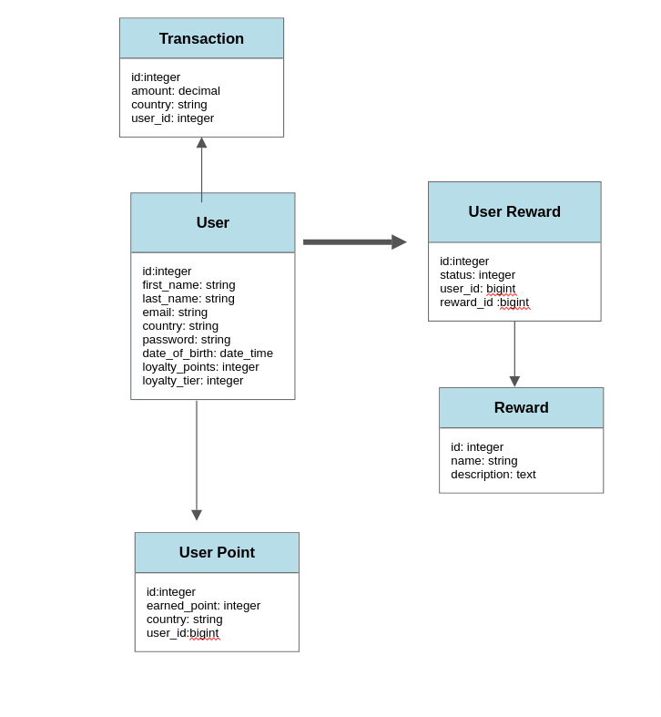

# README

## Problem statement
This platform offers clients the ability to issue loyalty points to their end users and end users use their points to claim/purchase rewards offered by the client. The loyalty points calculated based on the set of rules given by Perxtech.

Reference: https://github.com/PerxTech/backend-interview

## Point Earning Condition
- User receives 10 loyalty points for every $100 transaction. 
- User receives 2x standard loyalty points for transaction made in foreign country.

## Issuing Rewards Condition
- End user will be awarded Free Coffee reward for 100 loyalty points in one calendar month and on their birthday month. 
- A 5% Cash Rebate reward is given to all users who have 10 or more transactions with amount greater than $100 
- A Free Movie Tickets reward is given to new users when their first transaction is greater than $1000 within 60 days. 

## Loyalty Rules 
- Standard is the basic tier for all the user and based on points the tier will be increased to gold and platinum 
- User will receive 4x Airport Lounge Access Reward when he becomes a gold tier customer 
- Every calendar quarterly gives 100 bonus points for any user spending greater than $2000 in that quarter

## System Dependencies
- Ruby 3.1.2
- Rails 7.0.3

## Steps to setup
1. Install Postgresql
2. Git clone this repository
	 - git clone https://github.com/shubham-simform/loyalty-program.git
3. `bundle install`
4. `rails db:create` 
5. `rails db:migrate`
6. `rails db:seed`
7. `rails server`

## Running Tests
command to run all the specs
`rspec` 

## Services
- Sidekiq Cron `bundle exec sidekiq` for running scheduled jobs
	Can check the scheduled cron job here: http://localhost:3000/sidekiq/cron
  Reference https://github.com/ondrejbartas/sidekiq-cron

# Additional Features(Gems used)
## Authentication
- Used Devise gem for authentication
	Reference: https://github.com/heartcombo/devise
## Test Cases
- Added Rspec and written the test cases 
 Reference: https://github.com/rspec/rspec-rails
## Security
- CSRF token for none GET request
## Validation
- Added basic validation for the form to verify the data existence, both in frontend and backend
## Royalty Class Diagram

